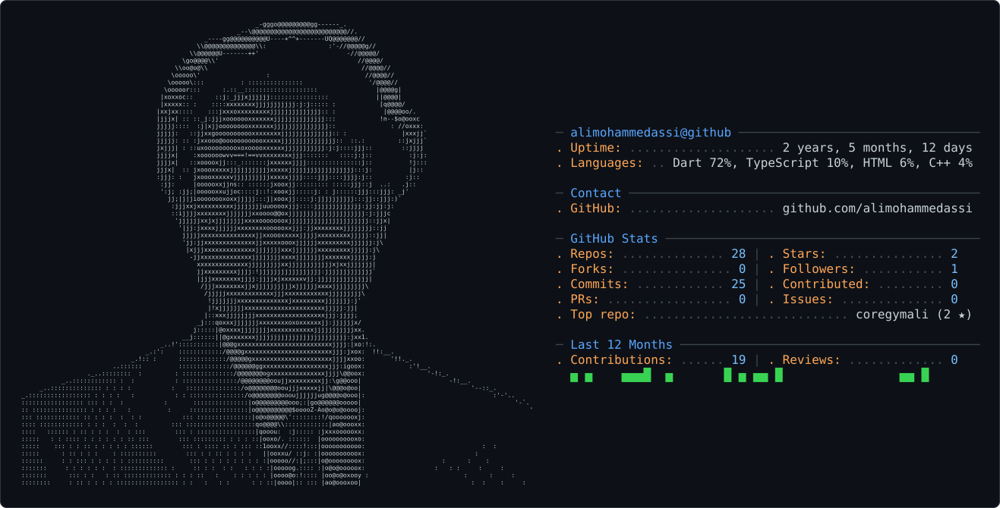

<picture>
  <source media="(prefers-color-scheme: dark)" srcset="dark_mode.svg" />
  <source media="(prefers-color-scheme: light)" srcset="light_mode.svg" />
  
</picture>

<!-- ════════════════════════════════════════════════════════════════════════════
     ALI ASSI — Flutter Developer & UI/UX Designer
     Profile README — drop this file in the repo: alimohammedassi/alimohammedassi
     ════════════════════════════════════════════════════════════════════════════ -->

---

## 🧑‍💻 About Me

```yaml
name: ALI ASSI
role: Flutter Developer × UI/UX Designer
currently_building: CORE
fuel: [protein, projects] 💪
philosophy: "Every pixel earns its place."
```

- 🔭 Currently building **Core** 
- 💪 **Flutter Dev × Gym Life** — same discipline, different muscle
- 🎨 **UI/UX first** — I design it in Figma, then bring it to life in Dart
- 🌱 Deep-diving **Flutter & Dart** — state management, clean architecture, animations
- 🏋️ Also shipped **Core** — a two-sided fitness coaching platform on one shared brain
- 📫 Reach me at **aliabouali2005@gmail.com**

---

## 📊 GitHub Stats

|  |  |
|:-:|:-:|

<div align="center">
  
</div>


---

## 🛠️ Tech Stack

<div align="center">

<a href="https://skillicons.dev">
  
</a>
<br/>
<a href="https://skillicons.dev">
  
</a>

</div>

---

## 🚀 Featured Projects

| 🏋️ **Core** — fitness coaching platform | 🛒 **NEXBUY** — e-commerce app |
|:-:|:-:|
| [](https://github.com/alimohammedassi/coregymali) | [](https://github.com/alimohammedassi/NEXBUY) |

| ✅ **QuickTask** — tasks, done fast | 🎬 **Cinamatch** — movie discovery |
|:-:|:-:|
| [](https://github.com/alimohammedassi/quicktask) | [](https://github.com/alimohammedassi/Cinamatch) |

| 🍣 **Sushiya** — restaurant experience | 🌱 **Future Life** |
|:-:|:-:|
| [](https://github.com/alimohammedassi/sushiya) | [](https://github.com/alimohammedassi/Future-life) |

---

## 🏆 GitHub Trophies


---

## 🐍 Contribution Snake

<picture>
  <source media="(prefers-color-scheme: dark)" srcset="https://raw.githubusercontent.com/alimohammedassi/alimohammedassi/output/github-contribution-grid-snake-dark.svg"/>
  <source media="(prefers-color-scheme: light)" srcset="https://raw.githubusercontent.com/alimohammedassi/alimohammedassi/output/github-contribution-grid-snake.svg"/>
  
</picture>

> ⚙️ *The snake is generated daily by a GitHub Action — see `generate-snake.yml`.*

---

## 🤝 Connect With Me

<div align="center">

<a href="https://www.linkedin.com/in/ali%20assi" target="_blank">
  
</a>
<a href="mailto:aliabouali2005@gmail.com">
  
</a>

</div>

---

<div align="center">

**"Train hard. Code harder."** 💙

</div>


